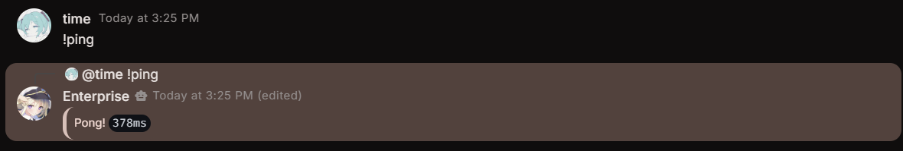
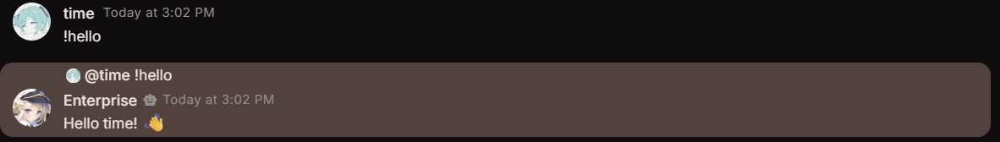
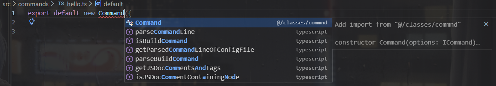

<Callout>
  This section assumes your prefix is `!`. If you changed your prefix, replace
  `!` with your actual prefix.
</Callout>

In this section, we will go over how to create commands for your bot. Commands are the main way users will interact with your bot.

The template comes with an example command called `ping`. You can find it in the `src/commands/ping.ts` file. This command will reply with the latency of the bot when a user types `!ping`.



## Creating Your First Command

Let's create a simple `hello` command:

```ts title="src/commands/hello.ts"
import { Command, PermissionLevel } from "@/classes/commnd";

export default new Command({
  name: "hello",
  description: "Greets you with a friendly message",
  aliases: ["hi", "hey"],
  cooldown: 3,
  permission: PermissionLevel.User,
  execute: async (client, message) => {
    await message.reply(`Hello ${message.author?.username}! 👋`);
  },
});
```

When someone types `!hello` (or `!hi` or `!hey`), the bot will reply with a greeting.



<Steps>
<Step>

### Create a file

In `src/commands/`, create a new file called `hello.ts`.

</Step>
<Step>

### Type the following code

```ts title="src/commands/hello.ts"
export default new Command({});
```

You might've noticed that when you start typing `new Command`, you get suggestions for the properties you can add. This is called **intellisense**. You can press <kbd>Enter</kbd> or <kbd>Tab</kbd> to quickly add the properties you need.



</Step>
<Step>

### Fill in the required properties

```ts title="src/commands/hello.ts"
// [!code ++]
import { Command, PermissionLevel } from "@/classes/commnd";

export default new Command({
  // [!code ++:3]
  name: "hello",
  permission: PermissionLevel.User,
  execute: async (client, message) => {},
});
```

</Step>
<Step>

### Add optional properties

```ts title="src/commands/hello.ts"
import { Command, PermissionLevel } from "@/classes/commnd";

export default new Command({
  name: "hello",
  // [!code ++:3]
  description: "Greets you with a friendly message",
  aliases: ["hi", "hey"],
  cooldown: 3,
  permission: PermissionLevel.User,
  execute: async (client, message) => {},
});
```

</Step>
<Step>

### Write your code in execute

```ts title="src/commands/hello.ts"
import { Command, PermissionLevel } from "@/classes/commnd";

export default new Command({
  name: "hello",
  description: "Greets you with a friendly message",
  aliases: ["hi", "hey"],
  cooldown: 3,
  permission: PermissionLevel.User,
  execute: async (client, message) => {
    // [!code ++]
    await message.reply(`Hello ${message.author?.username}! 👋`);
  },
});
```

</Step>
<Step>

### Save the file and test your command

Run your bot and type `!hello` in a server. The bot should reply with a greeting.


</Step>
</Steps>

## Properties

The template provides a `Command` class that you can use to create commands for your bot. You can find the `Command` class in the `src/classes/Command.ts` file.

<AutoTypeTable
  path="content/(stoatjs-bot)/(template)/interfaces.ts"
  name="Command"
/>
