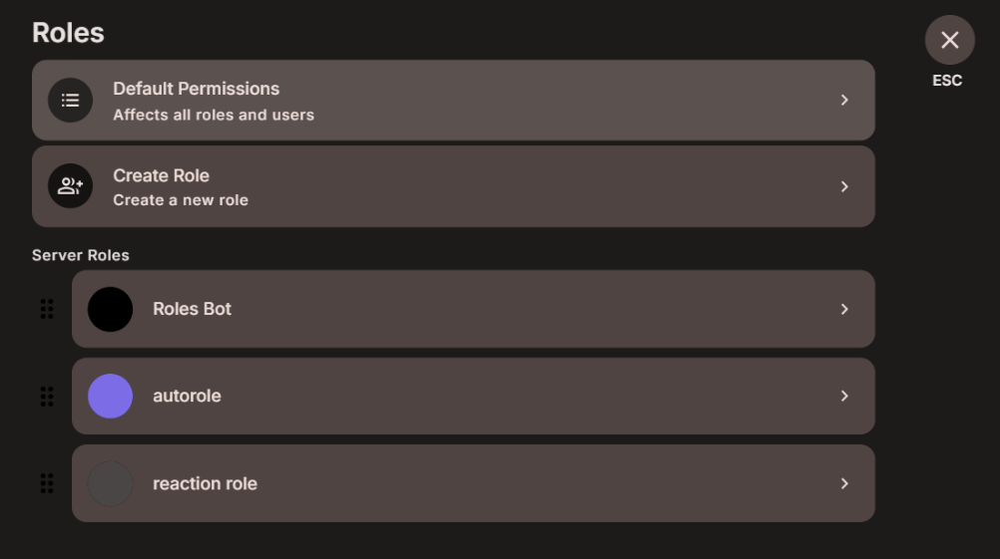

This page provides instructions for installing the StoatJS Bot.

<Callout>
  Ensure you have the **Manage Server** permission on the server where you want
  to install the bot.
</Callout>

<Steps>
<Step>

### Invite the Bot

- Click [here](https://stoat.chat/bot/01KHVFPW817V10PEDS77770XNT) to invite the bot to your server.

</Step>
<Step>

### Create a role for the bot

- Create a new role in your server settings (e.g., "Roles Bot").
- Assign the following permissions to the role:
  - Send Messages
  - React
  - View Channel
  - Assign Roles
- Ensure the bot's role is above any roles you are going to add as a reaction role or autorole.

- Save the role and give it to the bot.

</Step>
<Step>

### Setup and Configuration

- Follow the [Getting Started Guide](../getting-started) to set up your bot and configure it for your server.
- You can view all available commands [here](../../commands).

</Step>
</Steps>
