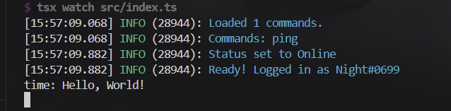

In this section, we will go over how to create events for your bot. Events are actions that happen on Stoat. Your bot can "listen" to these events and run code in response. Some common events include:

- **messageCreate** - Someone sends a message
- **messageReactionAdd** - Someone reacts to a message
- **ready** - Your bot successfully logs in
- **serverMemberJoin** - Someone joins the server

The template comes with some events in the `src/events/` folder.

## Creating Your First Event

Let's create a simple event that logs when someone sends a message:

```ts title="src/events/messageCreateLog.ts"
import { Event } from "@/classes/event";

export default new Event({
  name: "messageCreate",
  description: "Logs every message sent in the server",
  execute: (client, message) => {
    console.log(`${message.author?.username}: ${message.content}`);
  },
});
```

When someone sends a message, the bot will log the username and the content of the message in the console.

<Steps>
<Step>

### Create a file

In `src/events/`, create a new file called `messageCreateLog.ts`.

</Step>
<Step>

### Type the following code

```ts title="src/events/messageCreateLog.ts"
export default new Event({});
```

</Step>
<Step>

### Fill in the required properties

```ts title="src/events/messageCreateLog.ts"
// [!code ++]
import { Event } from "@/classes/event";

export default new Event({
  // [!code ++:2]
  name: "messageCreate",
  execute: (client, message) => {},
});
```

</Step>
<Step>

### Add optional properties

<Callout>We do not need `once: false` because `false` is the default value for `once`.</Callout>

```ts title="src/events/messageCreateLog.ts"
import { Event } from "@/classes/event";

export default new Event({
  name: "messageCreate",
  // [!code ++]
  description: "Logs every message sent in the server or DM",
  execute: (client, message) => {},
});
```

</Step>
<Step>

### Write your code in execute

```ts title="src/events/messageCreateLog.ts"
import { Event } from "@/classes/event";

export default new Event({
  name: "messageCreate",
  description: "Logs every message sent in the server or DM",
  once: false,
  execute: (client, message) => {
    // [!code ++]
    console.log(`${message.author?.username}: ${message.content}`);
  },
});
```

</Step>
<Step>

### Save the file and test your event

Run your bot and send a message in a server. You should see the message logged in the console.



</Step>
</Steps>

## Properties

The template provides an `Event` class that you can use to create event handlers. You can find the `Event` class in the `src/classes/Event.ts` file.

<AutoTypeTable path="content/docs/(stoatjs-bot)/(template)/interfaces.ts" name="Event" />
