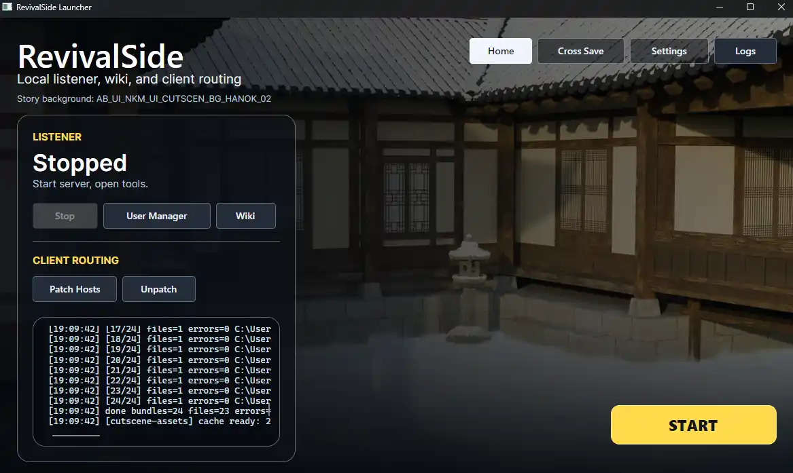

Now that you have RevivalSide installed, you can start the server to begin using it. Navigate to the "Home" tab in the launcher to find the options for starting and stopping the server, as well as connecting to either the RevivalSide server or the official servers.



## Starting the server

<Callout>
  When setting up RevivalSide for the first time, you will need to wait a while for the server to extract and set up the
  necessary files. This may take a few minutes, so please be patient.
</Callout>

To start the server, simply click on the "Start" button. This will start the RevivalSide server and [patch the hosts file](#connecting-to-revivalside) if you haven't done so already.

When the server is ready, you will see the following message in the console:

```
[19:18:55] [+] Listening on port 22000
[19:18:55] [+] Captured HTTP mirror listening on http://127.0.0.1:8088
[19:18:55] [+] Captured HTTP mirror fixtureDir=C:\Users\USER\AppData\Local\RevivalSide\server-data\captured-flows
[19:18:55] [+] User manager listening on http://127.0.0.1:8088/user-manager
```

## Stopping the server

To stop the server, simply click on the "Stop" button. This will stop the RevivalSide server. You will see the following message in the console when the server has stopped:

```
[19:20:40] Stopping listener...
[19:20:40] Listener stop requested.
[19:20:40] Listener stopped.
```

## Connecting to RevivalSide

In order to connect to the RevivalSide server, you will need to press the "Patch Hosts" button. After that, launch CounterSide and you should automatically connect to the RevivalSide server.

## Connecting to the official servers

If you want to connect to the official servers, you can do so by pressing the "Unpatch" button located next to "Patch Hosts". After that, launch CounterSide and you should automatically connect to the official servers.
