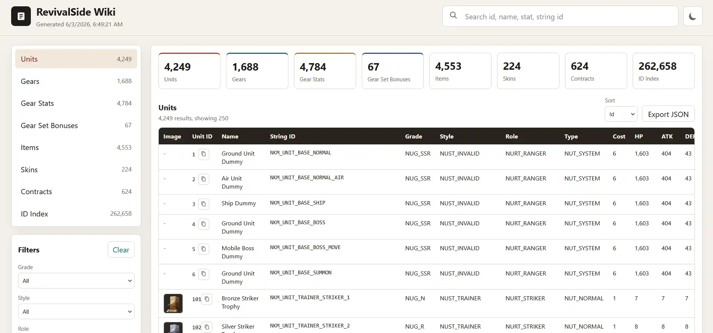

RevivalSide includes a built-in wiki that allows you to view the ids for all the units and items in the game.

## Starting the Wiki

Press the "Wiki" button on the "Home" page and wait for the assets to extract. Once the assets are extracted, the wiki will open in your default web browser.

<Callout>
This will take a few minutes, so please be patient.
</Callout>

## Stopping the Wiki

<Callout>
RevivalSide by default minimizes to the system tray if the server is running.
</Callout>

The wiki is a web application that runs in the background. If you want to stop the wiki, you have to fully close the RevivalSide launcher.