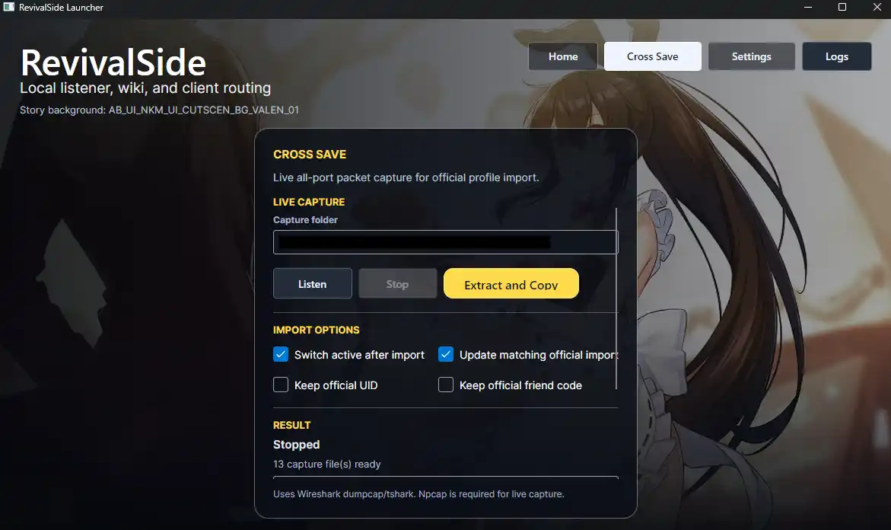
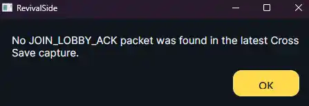

RevivalSide allows you to import your account data from the official servers, so you can save your progress without starting over. This guide will walk you through the process of importing your account data.



## Importing Account Data

<Steps>
<Step>

### Unpatch Hosts

If you have patched your hosts file to block the official servers, you will need to unpatch it before importing your account data. You can do this by following the instructions [here](./starting-and-connecting.mdx#connecting-to-the-official-servers).

</Step>
<Step>

### Capturing Packets

In order to import your account data, we need to capture packets from the official servers. To do this, head over to the "Cross Save" tab in the RevivalSide launcher and click on the "Listen" button. This will start listening for packets from the official servers.

</Step>
<Step>

### Login to the Official Servers

Once you have started listening for packets, login to CounterSide. RevivalSide will automatically capture the necessary packets.

</Step>
<Step>

### Extract and Copy Account Data

After logging in, head back to the "Cross Save" tab in the RevivalSide launcher, press "Stop" to stop listening for packets, and then click on the "Extract and Copy" button. RevivalSide will then import your account data.

<Callout>
  "Extract and Copy" will take a while to complete. In order to see the
  progress, head to the "Home" tab in the launcher and look at the console under
  "Patch Hosts".
</Callout>

The console will show you the progress of the import process. You should see something like the following:

```
[20:11:23] Scanning counterside-all-2-Wi-Fi-20260625-201008.pcapng...
[20:11:25]   5 candidate TCP stream(s)
[20:11:25]   stream 0: 18,074 bytes
{/* ... */}
[20:11:27] Scanning counterside-all-5-Tailscale-20260625-201008.pcapng...
[20:11:28]   23 candidate TCP stream(s)
[20:11:28]   stream 26: 312,755 bytes
[20:11:28] Cross Save import started from server:9.
{/* ... */}
[20:11:35] Found JOIN_LOBBY_ACK in counterside-all-5-Tailscale-20260625-201008.pcapng stream 26.
[20:11:35] Copied users.json export and clipboard text: ...
```

When you see the line `Found JOIN_LOBBY_ACK in ...`, it means that RevivalSide has successfully imported your account data.

</Step>
<Step>

### Launch User Manager

<Callout>
  Ensure the server is running before launching the User Manager. You can start
  the server by following the instructions
  [here](./starting-and-connecting.mdx#starting-the-server).
</Callout>

After importing your account data, you can launch the User Manager to ensure your data was imported correctly. You can do this by clicking on the "User Manager" button in the launcher. This will allow you to view and manage account data on RevivalSide.


</Step>
</Steps>

## Troubleshooting

### No JOIN_LOBBY_ACK packet was found

<Callout>
  This is error can be caused by a number of issues. If you have a solution that
  isn't listed here, please let us know.
</Callout>



If you are getting the error "No JOIN_LOBBY_ACK packet was found...", it means that RevivalSide was unable to capture or parse the necessary packets from the official servers. This can be caused by a number of issues, such as your firewall or vpn.

In order to fix this, you can try the following:

- Disable your VPN
- Disable your firewall
