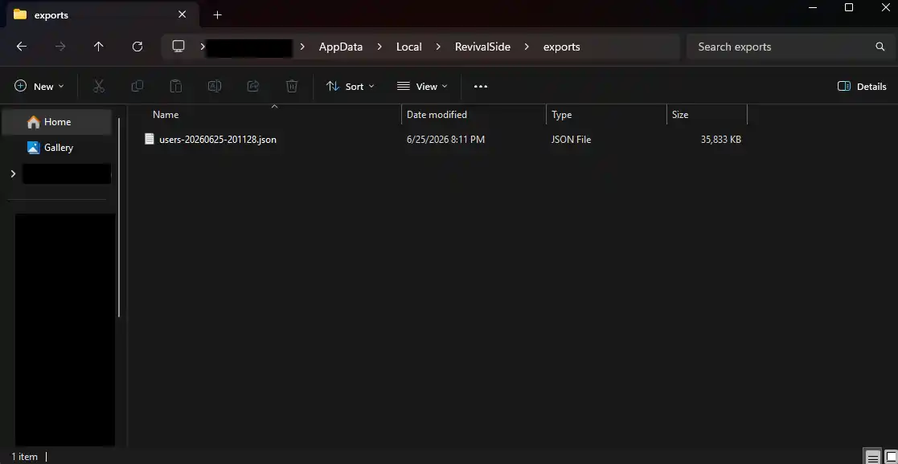
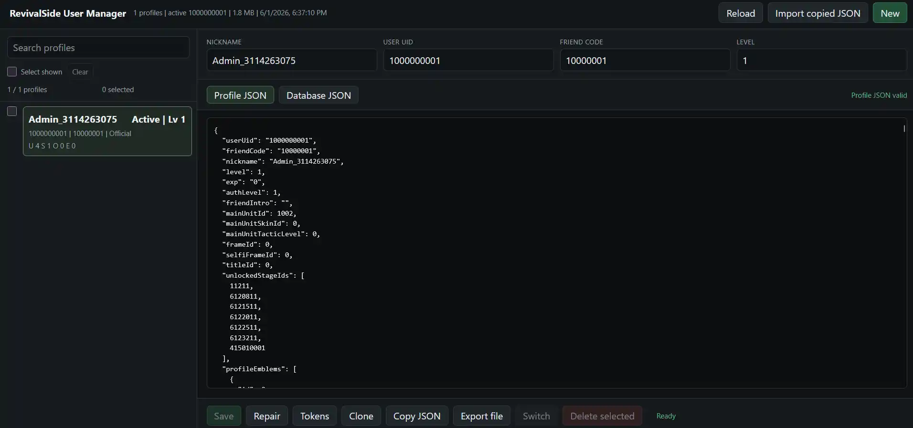

Before you can save your account data, you will need to import it from the official servers. If you haven't done that yet, please follow the instructions [here](./importing-account-data.mdx).

There are two ways to save your account data:

- [Exports Folder](#exports-folder-recommended)
- [User Manager](#user-manager)

## Exports Folder (Recommended)

The recommended way to save your account data is to use the "exports" folder. This folder is located in the RevivalSide installation directory and contains a copy of your account data. If you haven't changed the installation directory, the default location is:

```
C:\Users\%USERNAME%\AppData\Local\RevivalSide\exports
```



## User Manager

The User Manager is a tool that allows you to manage account data on the RevivalSide server. You can access it by clicking on the "User Manager" button in the launcher.

On the User Manager page, you will see a list of accounts. Select the account you want to save and click on the "Export file" button on the bottom.

