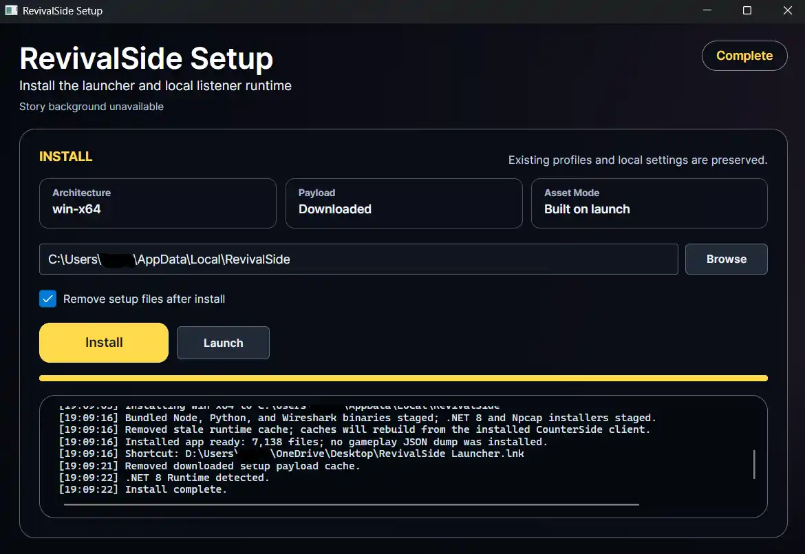

## Installing RevivalSide

Head over to the [releases](https://github.com/MadlyMoe/RevivalSide/releases/latest) page on GitHub and download the latest version of the launcher. Currently, the launcher is only available for Windows and Android. Once you have downloaded the launcher, run it and follow the prompts to install RevivalSide.

### Windows

<Callout>
  The default installation path is `C:\Users\%USERNAME%\AppData\Local\RevivalSide`.
</Callout>

For Windows, download the `RevivalSideSetup.exe` file and run it. Follow the prompts to install RevivalSide. Once the installation is complete, it should automatically start the RevivalSide launcher.

